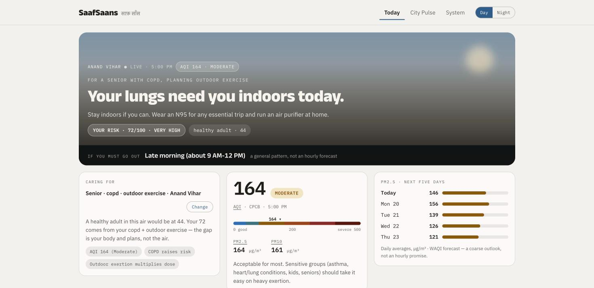
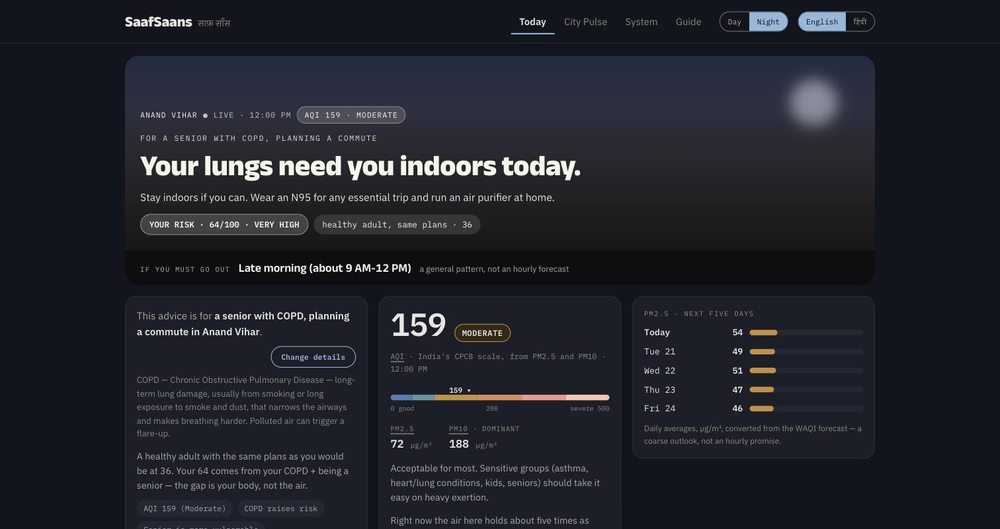
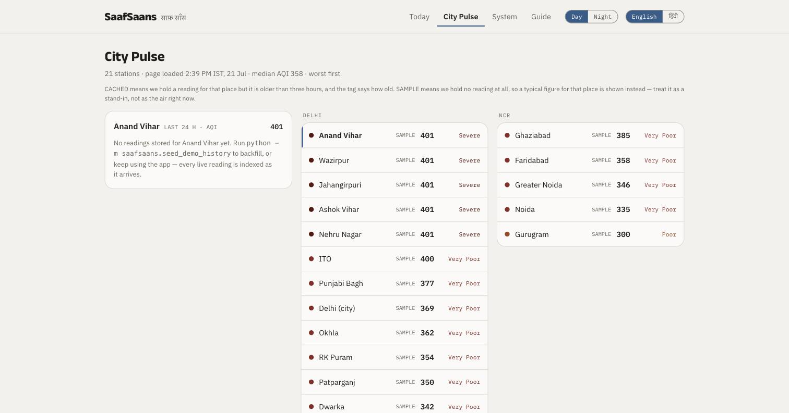
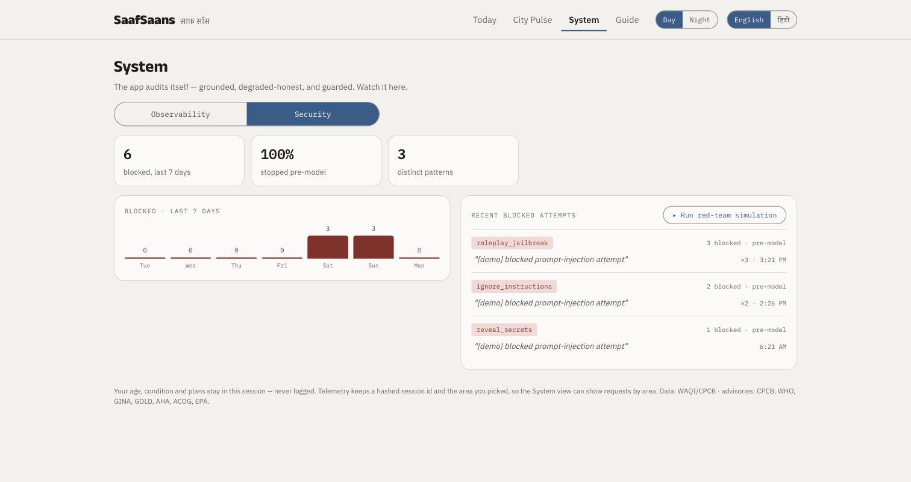
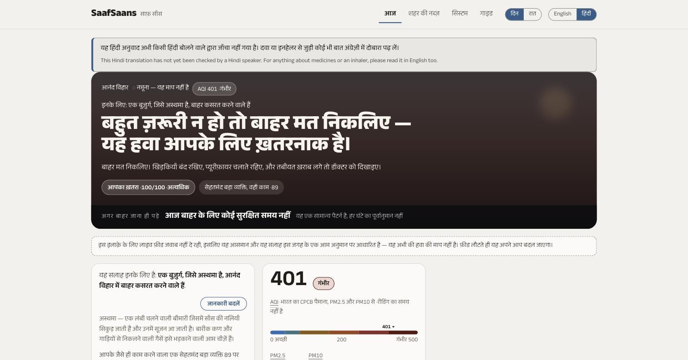

# SaafSaans — Delhi Air Quality & Public Health Companion

Answers one question in under five seconds: **"Is it safe for *me* to go outside right now, and if not, when?"**

Set a persona (age, health condition, planned activity, locality) and SaafSaans shows the live
air quality where you are, scores **your** risk rather than the city's, tells you the best window
to go out, and answers plain-language questions with advice grounded in retrieved health
guidance — every answer showing its sources.



The concept is **the sky is the interface**: the hero renders the air you are being told about,
so severity is felt before it is read. The gradient and haze density track the CPCB band.

| Night | City Pulse | System |
|---|---|---|
|  |  |  |

Hindi is drafted and gated behind a banner saying no Hindi speaker has checked it:



## Run it

```bash
python3.11 -m venv .venv && source .venv/bin/activate
pip install -r requirements.txt
cp .env.example .env                      # optional: blank = mock mode
python saafsaans/setup_indices.py         # create 4 indices + seed 34 advisories
python -m saafsaans.seed_demo_history     # optional: backfill so System has data
uvicorn saafsaans.web.main:app --reload --port 8010
```

Runs with **zero keys**: every external call is timeout-bounded with a deterministic fallback.
Add `WAQI_TOKEN`, `OPENROUTER_API_KEY`, and Elastic credentials to light up live data, the model,
and the dashboards.

To put it on the internet, see [`docs/DEPLOY.md`](docs/DEPLOY.md) — a `Dockerfile` that has been
built and run, and the current free-tier terms of five hosts with the URL each claim was read
from. Nothing has been deployed; that needs an account this repository does not have.

## Four views

- **Today** — sky hero, personal risk against a healthy-adult baseline, best-time window, the
  reading with its position on the CPCB scale, how today compares with the World Health
  Organization's guideline in plain words, a five-day PM2.5 outlook, and grounded Q&A.
- **City Pulse** — 21 Delhi/NCR stations sorted worst-first, plus a 24-hour trend.
- **System** — Observability (latency, fallback rates, token spend) and Security (blocked
  prompt-injection attempts, with a live red-team simulation). The app auditing itself.
- **Guide** — plain-language explanation of every number and term: the glossary, all six
  CPCB bands with what each means for you, and what each health condition in the picker
  actually is. Linked from the term that confused you.

## Architecture

1. **WAQI** (`services/waqi.py`) fetches live AQI; readings are indexed into `aqi-readings`.
2. **Elasticsearch** (`services/es.py`) retrieves health advisories by AQI band and persona,
   and aggregates the time series behind the System views.
3. **Guard** (`services/guard.py`) blocks prompt injection *before* the model, auditing to
   `security-events`.
4. **LLM** (`services/llm.py`) answers from verified context, falling back to rule-based advice.
5. **FastAPI + Jinja2** (`web/`) renders everything server-side; `web/presenters.py` holds the
   copy and geometry.
6. **Telemetry** goes to `app-telemetry`, read live by the System view.

**No JavaScript.** Not "degrades gracefully" — the app ships zero `<script>` tags. Every control
is a link or a form, and disclosure state rides in the query string, which is also what gives the
"opening one definition closes another" behaviour. A test asserts this.

## Design

The UI implements the approved handoff in [`design_handoff_saafsaans/`](design_handoff_saafsaans/).
Two decisions worth calling out:

**The CPCB colour ramp is not used as a data encoding.** It is non-monotonic in lightness
(official "Good" `#00E400` is *darker* than "Moderate" `#FFFF00`), `#FFFF00` measures ~1.07:1 on
white, and in dark mode maroon `#7E0023` falls to ~1.4:1 — making the *most severe* band the
*least visible*. Severity here always correlates with contrast against the background, so the
ramp inverts its lightness direction between themes. The US EPA publishes its own accessible
alternate ("ColorVision Assist") for the same reason.

**Degradation is visible, never disguised.** A cached reading says `◌ CACHED`, a dead feed shows
a notice, and a rule-based answer is logged as one. The Observability view exists to make that
checkable rather than claimed.

## What Elasticsearch is, and is not, used for

Worth settling, because "Elasticsearch" invites the assumption that something is being
searched.

**It is not a search engine here.** There is not one full-text query in the application:

```bash
grep -rnE "multi_match|query_string|fuzzy|match_phrase|\"match\"" saafsaans --include='*.py'
# no matches
```

**What it actually does** is two things. It aggregates time series for the System views —
`terms`, `percentiles`, `date_histogram` and `top_hits` over the telemetry and security
indices (`services/metrics.py`). And it retrieves advisories with `range` filters on the AQI
band plus `term` clauses on the persona keywords (`services/es.py`) — exact matching on
keyword fields, with the score coming from how many persona terms hit, not from relevance
over prose.

**The app runs without it.** `search_advisories` falls back to an in-process filter over the
same 34 seeded advisories, every metrics call is guarded, and the System views render their
designed empty states. Verified rather than asserted: the container in
[`docs/DEPLOY.md`](docs/DEPLOY.md) runs with no Elasticsearch at all and `/health` returns
`{"ok":true,"es":"none",...}` while every view serves 200.

## Threat model

**Sensitive data.** Age, health condition, and planned activity form a sensitive persona.
They live only in the URL and the request — never written to any index. **Locality is the one
exception and is written deliberately:** telemetry stores the station name so the Observability
view can show requests by area. It is a coarse, non-identifying label (one of 21 public
monitoring stations), never paired with the health condition. The field whitelists in
`services/es.py` (`TELEMETRY_FIELDS`, `SECURITY_FIELDS`) enforce that boundary in code rather
than by convention. Logs store a `session_hash` (sha256, truncated) and `prompt_excerpt` is
capped at 120 characters. Chat transcripts, which hold raw questions, stay in process memory
and are never persisted.

**Untrusted input.** The only untrusted input is the user's question. Defence is layered:
`guard.check` blocks injection and oversized input before any model call; the system prompt is a
fixed constant and the question is framed as *data, not instructions*; every attempt is audited.

**Exposed edges.** Secrets live only in `.env` (git-ignored). Every outbound call is
timeout-bounded (WAQI 5s, LLM 30s, ES 10s) with a graceful fallback.

## Layout

```
saafsaans/
  web/
    main.py             FastAPI routes + orchestration
    presenters.py       verdict copy, comparison line, scale geometry, SVG sparkline
    templates/          base · today · city · system · guide
    static/app.css      design tokens, per-band sky, severity ramp
  services/
    config · normalize · guard · waqi · forecast · risk · es · metrics · llm
  data/advisories.py    34 seed advisories
  setup_indices.py · seed_demo_history.py · attack_demo.py
tests/                  363 tests
docs/                   design brief, screenshots, specs
```

## Known limitations

- **The Hindi is drafted, not reviewed.** `?lang=hi` serves a committed Hindi translation of
  the verdict, the advice, the AQI band meanings, the glossary, the Guide and all 34
  advisories. **No Hindi speaker has checked it**, so every Hindi page carries a banner saying
  so, and that banner is a condition of the feature shipping rather than a nicety — a
  mistranslated instruction about an inhaler is worse than English. The persona sentence, the
  comparison line and the driver chips are still English: they are composed in Python rather
  than looked up, and translating them needs `presenters.py` restructured.
- **Roughly half the station feeds do not work.** An audit of all 21 on 20 July 2026 found 11
  slugs returning 404 and several serving month-old readings as current. The app now checks
  the feed's own station name against the locality on every fetch and refuses readings older
  than twelve hours, so a locality with no working feed shows a labelled sample instead of a
  stranger's air. On that day, 12 localities were live and 9 were on samples.
- **WAQI data is non-commercial.** Their terms forbid resale, use in paid applications, and
  redistributing cached or archived data. Fine for this; a commercial deployment would need
  OpenAQ or a direct CPCB agreement.
- **The risk score is half evidence and half judgement**, and the app says which is which. The
  exertion term comes from the US EPA Exposure Factors Handbook 2011 Table 6-2, whose own
  confidence rating EPA gives as Medium. The health-condition and age terms are an unvalidated
  clinical heuristic: there is no citable multiplier for how much worse polluted air is with
  COPD, so none was invented. The Guide publishes every weight and its source.
- **The air index is computed, not received.** The WAQI feed publishes on the US EPA scale and
  its `iaqi` values are AQI sub-indices, not concentrations. The app inverts them to
  micrograms and recomputes India's CPCB index — **from PM2.5 and PM10 only**, where CPCB uses
  up to eight pollutants and requires at least three. On a gas-dominated day the official CPCB
  figure would be higher than this one. See `services/aqi_scale.py`.

## Licence

MIT with an attribution clause — see [`LICENSE`](LICENSE). Two carve-outs:
`design_handoff_saafsaans/` is third-party design reference material, and WAQI data
retrieved at runtime is subject to WAQI's own non-commercial terms.

**Not medical advice.** General guidance from public readings and published advisories.
The personal risk score is a documented heuristic, not a validated clinical instrument.

## Retrospective and decision record

This project was built for a hackathon and did not place.

- [`RETROSPECTIVE.md`](RETROSPECTIVE.md) — why it lost, and what changed as a result.
- [`docs/CASE-STUDY.md`](docs/CASE-STUDY.md) — the full decision record: the adversarial
  code review that found a false privacy claim in this README, the research that cancelled
  the planned successor, and an explicit list of what this work does *not* demonstrate.
- [`docs/METHODOLOGY.md`](docs/METHODOLOGY.md) — the review method, generalised. Domain
  independent, with measured kill rates and its own limitations.
- [`docs/review-workflow.js`](docs/review-workflow.js) — a runnable, parameterised version
  of that review for any repository.
